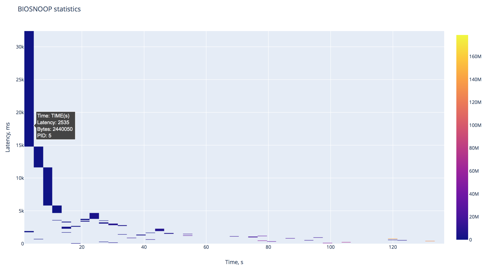

# IO pattern visualization tool.

## Purpose 
Visualizing the IO-related data via the Heat Map. What makes it unique is the additional info about the process that performs the IO operations. 

## Heatmap example 
<br/>
## Usage

```
$ pip install plotly 
$ python3 ./biosnoop-statistics-visualization.py <path_to_bcc_tools> <amount_of_metrics_to_collect>
```
* <path_to_bcc_tools>  - path to the valid BCC tools file. The implementation has been tested using BIOSNOOP;
* <amount_of_metrics_to_collect> - amount of metrics to collection from the script launched from <path_to_bcc_tools>;

After that, the heatmap will be opened within your browser.

